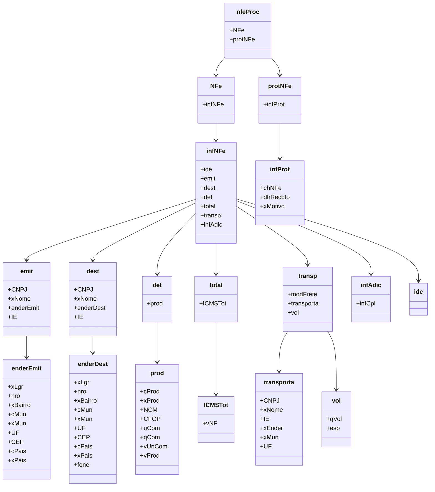

# NF-e Documentação

Este repositório contém uma representação simplificada da estrutura de um documento fiscal eletrônico (NF-e) em formato JSON, bem como um diagrama de classe correspondente.

## Arquivos

- `nf_e.json`: Este arquivo contém uma representação simplificada de um documento fiscal eletrônico em formato JSON.
- `diagrama_classe.png`: Uma imagem do diagrama de classe correspondente ao JSON.

## Estrutura do JSON

O arquivo `nf_e.json` contém um objeto `nfeProc`, que inclui os seguintes elementos:

- `NFe`: Contém informações relacionadas à Nota Fiscal Eletrônica.
- `protNFe`: Contém informações relacionadas ao protocolo da NF-e.

Cada elemento contém sub-elementos que representam diferentes seções do documento, como informações do emitente, destinatário, produtos, transporte, etc.

## Diagrama de Classe

O diagrama de classe representa graficamente a estrutura do documento fiscal eletrônico, incluindo suas diferentes seções e os atributos correspondentes.

 